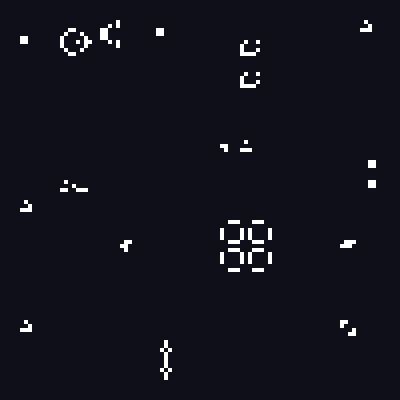

# Lab 2 — Conway's Game of Life

Implementación del **Juego de la Vida de Conway** en Rust usando [raylib](https://www.raylib.com/), desarrollada para el Laboratorio 2 de Gráficos por Computadora.

Autor: **Javier Alvarado**

---

## 📖 Descripción

El Juego de la Vida es un autómata celular ideado por el matemático John Conway en 1970. Se juega sobre una grilla de celdas donde cada una puede estar **viva** o **muerta**, y su estado evoluciona en pasos discretos según reglas muy simples:

1. Una celda **viva** con **2 o 3** vecinas vivas **sobrevive**.
2. Una celda **viva** con menos de 2 o más de 3 vecinas **muere** (soledad o sobrepoblación).
3. Una celda **muerta** con exactamente **3** vecinas vivas **nace**.

A partir de estas reglas emergen patrones complejos: estructuras estáticas, osciladores y naves que se desplazan por la grilla.

En esta implementación la grilla es **toroidal** (los bordes se conectan entre sí), por lo que los patrones que salen por un lado reaparecen por el opuesto.

---

## 🎬 Demo



> El GIF muestra las primeras 150 generaciones de la escena inicial: el cañón de Gosper disparando planeadores, las naves ligeras cruzando la grilla y el R-pentomino expandiéndose.

---

## ✨ Características

- Grilla de **100 × 100** celdas, escalada a **8 px** por celda (ventana de 800 × 800).
- Bordes con envolvente (*wrap-around*), la grilla se comporta como un toroide.
- Un paso de simulación cada **6 frames** (a 60 FPS) para una animación fluida.
- Contador de FPS en pantalla.
- Escena inicial poblada con una gran variedad de patrones clásicos.
- Exportación de la simulación a **GIF animado** con la bandera `--gif`, sin necesidad de abrir la ventana.

### Patrones incluidos

| Categoría | Patrones |
|-----------|----------|
| Naves | glider, LWSS (nave ligera) |
| Cañones | gosper glider gun |
| Osciladores | pulsar, pentadecathlon, beacon, toad |
| Metuselah | R-pentomino, diehard, acorn |
| Estáticos | block |

---

## 📂 Estructura del proyecto

```
Lab-2-Graficos/
├── Cargo.toml           # Configuración del paquete y dependencias
├── game_of_life.gif     # GIF generado con `cargo run --release -- --gif`
└── src/
    ├── main.rs          # Ventana, bucle principal, siembra de patrones y exportación a GIF
    ├── life.rs          # Lógica del autómata (reglas y vecindad)
    ├── patterns.rs      # Definición de los patrones clásicos
    └── framebuffer.rs   # Framebuffer y colores de las celdas
```

### Dependencias

| Crate | Uso |
|-------|-----|
| [`raylib`](https://crates.io/crates/raylib) `5.1.1` | Ventana, bucle de render y dibujo de las celdas |
| [`image`](https://crates.io/crates/image) `0.25` | Codificación del GIF animado (solo la feature `gif`) |

---

## 🛠️ Requisitos

- [Rust](https://www.rust-lang.org/tools/install) (edición 2024) con `cargo`.
- Dependencias de sistema de raylib (compilador C, CMake y librerías de OpenGL/X11 en Linux).

En Ubuntu/Debian:

```bash
sudo apt install build-essential cmake libx11-dev libxrandr-dev \
    libxi-dev libgl1-mesa-dev libglu1-mesa-dev libxcursor-dev libxinerama-dev
```

---

## 🚀 Ejecución

Desde la raíz del proyecto:

```bash
# Modo desarrollo
cargo run

# Modo optimizado (recomendado para mejor rendimiento)
cargo run --release
```

La primera compilación descarga y construye raylib, por lo que puede tardar unos minutos.

Controles: la simulación corre sola; se cierra con `ESC` o el botón de la ventana.

---

## 🎥 Generar el GIF

Para exportar la animación a un GIF (no abre ventana, así que también funciona sin entorno gráfico):

```bash
cargo run --release -- --gif
```

Esto escribe `game_of_life.gif` en la raíz del proyecto, con **150 generaciones** a **90 ms por frame** y una escala de **4 px** por celda. Reutiliza la misma escena inicial y los mismos colores que el render en pantalla.

---

## ⚙️ Configuración

Los parámetros principales se pueden ajustar en `src/main.rs`:

| Constante | Valor | Descripción |
|-----------|-------|-------------|
| `GRID_WIDTH` / `GRID_HEIGHT` | `100` | Dimensiones de la grilla en celdas |
| `SCALE` | `8` | Tamaño en píxeles de cada celda |
| `FRAMES_PER_STEP` | `6` | Frames entre cada paso de la simulación (menor = más rápido) |
| `GIF_SCALE` | `4` | Tamaño en píxeles de cada celda dentro del GIF (dentro de `record_gif`) |
| `GIF_FRAMES` | `150` | Cantidad de generaciones que se graban en el GIF (dentro de `record_gif`) |

Para modificar la escena inicial, edita la función `seed_pattern` en `src/main.rs` cambiando los patrones y sus posiciones `(x, y)`.

Los colores de las celdas (blanco para vivas, azul muy oscuro para muertas) están en la función `get_color` de `src/framebuffer.rs`.
